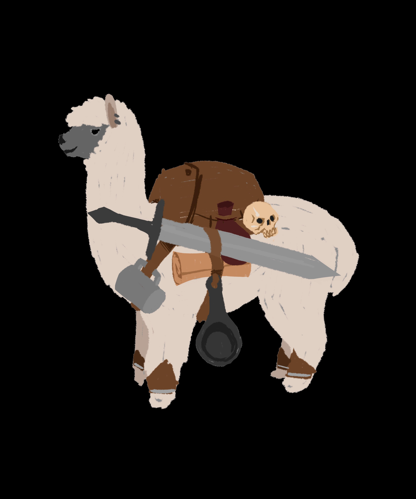
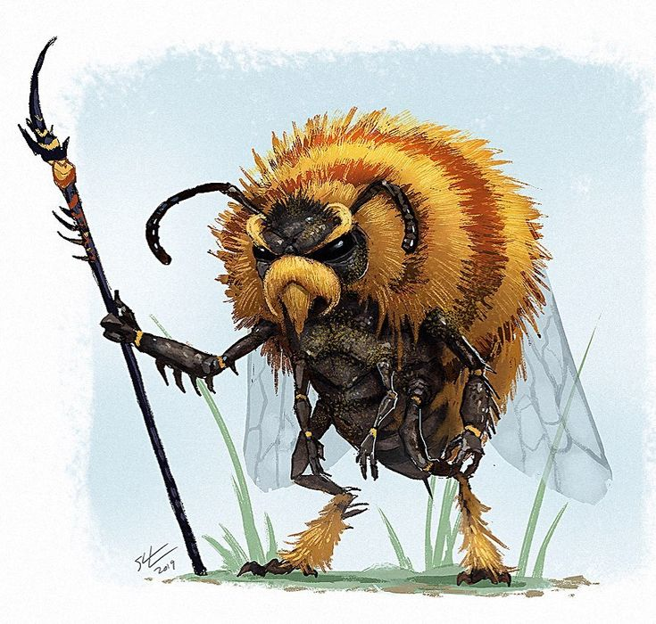
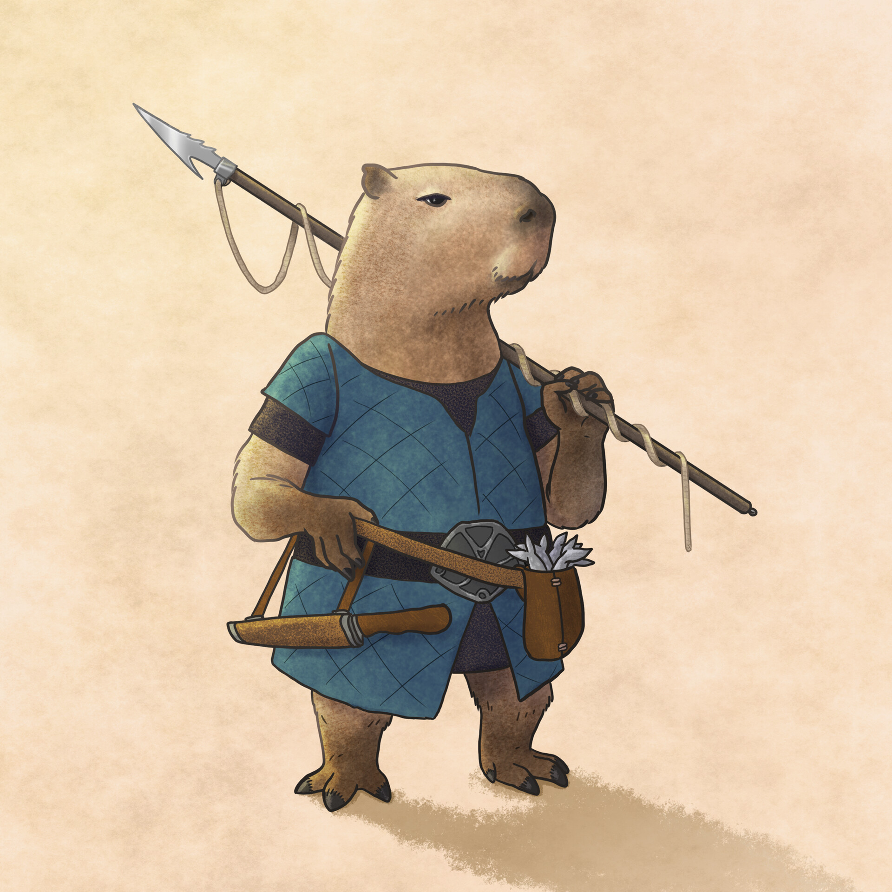
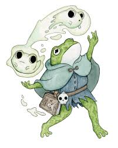
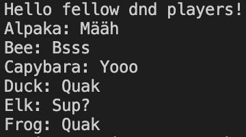

# Welcome to DnD!
Dieses Repo repräsentiert eine DnD (Dungeons & Dragons) Spielrunde. Sie sind einer der unten abgebildeten Player. Der Dungeon Leiter heisst Sie willkommen:)

Alpaka            |  Bee
:-------------------------:|:-------------------------:
  |  
__Capybara__         |  __Frog__
  |  

*To see the markdown as a rendered version in VS Code, press CTRL+SHIFT+V.*

## Anweisungen:
1. Jedes Team darf sich ein Tier auswählen und das dazugehörige Python File.
2. Erstellen Sie einen neuen Branch (sinnvoller Name) und wechseln Sie darauf. 
3. Öffnen Sie nun die Ihnen zugewiesene Python Datei und schreiben Sie eine kleine Funktion, in der Ihr Tier seine Antwort printed. Sie sehen, wie die Funktion heissen soll im leader.py File auf Zeile 10-13. Zum Beispiel könnte es "Katze: Miau" printen.
4. Testen Sie Ihre Funktion, in dem Sie die entsprechende Zeile im leader.py File auskommentieren und dann laufen lassen. 
5. Fügen Sie nun Ihre Änderungen mithilfe git hinzu, committen und dann pushen:) (Falls das nicht über das Terminal geht, machen Sies im GUI links beim Git Button)

__Bravo! Der lokale Teil ist erledigt!__

### Remote
6. Gehen Sie nun auf Github. Wenn Sie das Repo öffnen, werden Sie oben einen Button sehen *compare & pull request*. Wenn Sie darauf klicken, können Sie versuchen, einen Merge mit dem main branch zu beantragen (das nennt man pull request).
7. Schauen Sie, ob Sie einen pull request von einem anderen Team sehen und versuchen Sie, die Änderungen einzusehen und den Merge zu vollziehen.

__Bravo! Falls das nun geklappt hat, ist einer von Ihren Feature Branches mit dem main gemergt worden__

## Endresultat
Am Schluss, wenn alle Teams ihr Feature richtig in den main Branch reingemergt haben, können Sie wieder pullen und das leader.py File wieder laufen lassen. Der Output sollte dann hoffentlich so aussehen:

